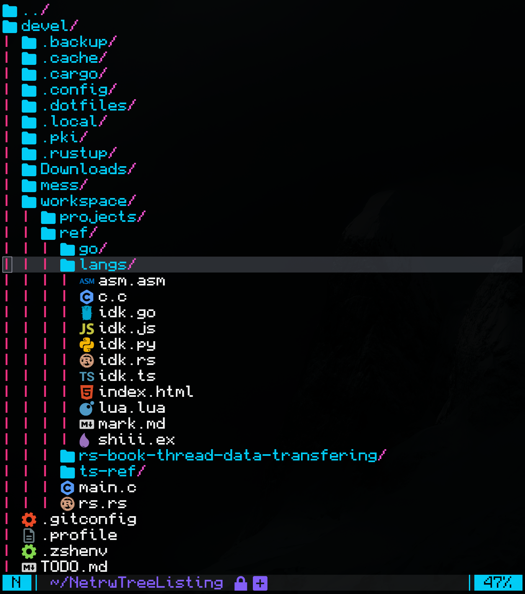

# netrw-icons.nvim

A lightweight extension for Neovim's built-in `netrw` file explorer that adds file icons without replacing or modifying netrw's core functionality.



## Features

- **Icon support**: works with `nvim-web-devicons`, `mini.icons`, or manually specified via config
- **Customizable**: Override icons per file type or extension
- **Lightweight**: Minimal performance impact

## Requirements

- Neovim ≥ 0.9
- One of the following:
  - [`nvim-web-devicons`](https://github.com/nvim-tree/nvim-web-devicons)
  - [`mini.icons`](https://github.com/echasnovski/mini.nvim)


## Installation

### Using [lazy.nvim](https://github.com/folke/lazy.nvim)

```lua
{
  "Fasamii/netrw-icons.nvim",
  dependencies = {
    "nvim-tree/nvim-web-devicons", -- or "echasnovski/mini.icons"
  },
  config = function()
    require("netrw-icons").setup()
  end,
}
```

### Using [packer.nvim](https://github.com/wbthomason/packer.nvim)

```lua
use {
  "Fasamii/netrw-icons.nvim",
  requires = {
    "nvim-tree/nvim-web-devicons", -- or "echasnovski/mini.icons"
  },
  config = function()
    require("netrw-icons").setup()
  end,
}
```

### Using [vim-plug](https://github.com/junegunn/vim-plug)

```vim
Plug 'nvim-tree/nvim-web-devicons' " or 'echasnovski/mini.icons'
Plug 'Fasamii/netrw-icons.nvim'

" In your init.vim or after plug#end()
lua require("netrw-icons").setup()
```


## Configuration

### Default Configuration

```lua
require("netrw-icons").setup({
  -- Icon provider preference: "devicons", "miniicons", or nil for auto-detect
  prefer = nil,
  
  -- Show generic file icon when no specific icon is found for a file type
  icon_fallback = true,
  
  -- Icon definitions
  file = { -- If you don't have any overrides you can just set to true
    -- Custom icons per file extension
    -- Can be a string (icon only) or a table { icon, highlight_group }
    -- for example: lua = {"WOAH: ", "Function"},
    -- or lua = { "WOAH: " },

    -- Reserved keys for special file types
    dir = " ",  -- Directory icon
    sym = "",  -- Symlink icon
    exe = "",  -- Executable icon
  },
})
```

### Configuration Examples

#### Minimal Setup

```lua
require("netrw-icons").setup()
```

#### Prefer Specific Icon Provider

```lua
require("netrw-icons").setup({
  prefer = "devicons", -- or "miniicons"
})
```

#### Custom Icons

```lua
require("netrw-icons").setup({
  file = {
    dir = " ",
    sym = " ",
    exe = "EXEHERE: ",
    
    -- String format (icon only)
    lua = "LUA ---->",
    md = " ",
    
    -- Table format (icon + highlight group)
    ts = { "󰛦 ", "Type" },
  },
})
```

#### Disable Default Icons

```lua
require("netrw-icons").setup({
  icon_fallback = false, -- Only show icons for explicitly defined types found by provider or in
                         -- the file = {} table
})
```

#### No Icons (Disable Plugin)

```lua
require("netrw-icons").setup({
  file = false, -- Completely disable icons
})
```

## Supported Netrw List Styles

Currently, this plugin supports:
- **Style 0**: `let g:netrw_liststyle = 0`
- **Style 1**: `let g:netrw_liststyle = 1`
- **Style 3**: `let g:netrw_liststyle = 3`

To set style of netrw:

```vim
" In init.vim
let g:netrw_liststyle = 3 " or 0 or 1
```

```lua
-- In init.lua
vim.g.netrw_liststyle = 3 -- or 0 or 1
```
